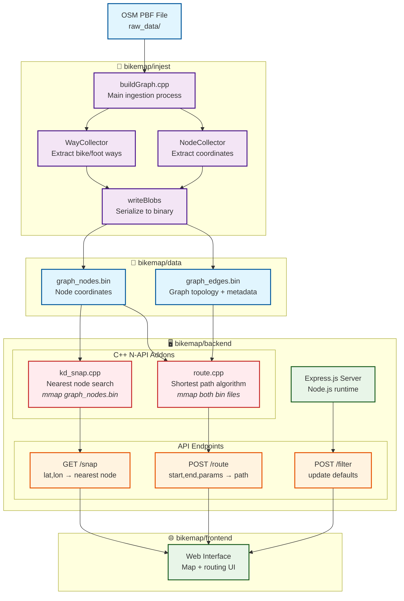

# BikeMap Application Architecture

## System Overview


# binary file formats
```
graph_nodes.bin

┌─────────────────┬──────┬─────────────────────────────────┐
│ NodesHeader     │ 16B  │ File metadata                   │
├─────────────────┼──────┼─────────────────────────────────┤
│   magic[8]      │  8B  │ "MMAPNODE" identifier           │
│   numNodes      │  4B  │ Count of nodes (N)              │
│   reserved      │  4B  │ Padding                         │
├─────────────────┼──────┼─────────────────────────────────┤
│ NodeIDs         │ N*8B │ OSM node identifiers            │
│   id[0]         │  8B  │ uint64_t                        │
│   id[1]         │  8B  │ uint64_t                        │
│   ...           │ ...  │ ...                             │
│   id[N-1]       │  8B  │ uint64_t                        │
├─────────────────┼──────┼─────────────────────────────────┤
│ Latitudes       │ N*4B │ Coordinates (degrees)           │
│   lat[0]        │  4B  │ float32 (WGS84)                 │
│   lat[1]        │  4B  │ float32                         │
│   ...           │ ...  │ ...                             │
│   lat[N-1]      │  4B  │ float32                         │
├─────────────────┼──────┼─────────────────────────────────┤
│ Longitudes      │ N*4B │ Coordinates (degrees)           │
│   lon[0]        │  4B  │ float32 (WGS84)                 │
│   lon[1]        │  4B  │ float32                         │
│   ...           │ ...  │ ...                             │
│   lon[N-1]      │  4B  │ float32                         │
└─────────────────┴──────┴─────────────────────────────────┘
```
```
graph_edges.bin

Format: Compressed Sparse Row (CSR) adjacency list
Edge lookup: for node i, edges are neighbors[offset[i]:offset[i+1]]

┌─────────────────────┬────────┬─────────────────────────────────────────┐
│ EdgesHeader         │  20B   │ File metadata                           │
├─────────────────────┼────────┼─────────────────────────────────────────┤
│   magic[8]          │   8B   │ "MMAPEDGE" identifier                   │
│   numNodes          │   4B   │ Count of nodes                          │
│   numEdges          │   4B   │ Count of directed edges                 │
│   hasSurfacePrimary │   1B   │ Surface data present (1)                │
│   hasModeMask       │   1B   │ Mode data present (1)                   │
│   lengthType        │   1B   │ Length format (0=float32)               │
│   reserved          │   1B   │ Padding                                 │
├─────────────────────┼────────┼─────────────────────────────────────────┤
│ Array Sizes         │  20B   │ Defensive parsing metadata              │
│   offsetsSize       │   4B   │ uint32_t: offsets array length          │
│   neighborsSize     │   4B   │ uint32_t: neighbors array length        │
│   lengthsSize       │   4B   │ uint32_t: lengths array length          │
│   surfacePrimSize   │   4B   │ uint32_t: surface array length          │
│   modeMasksSize     │   4B   │ uint32_t: mode masks array length       │
├─────────────────────┼────────┼─────────────────────────────────────────┤
│ Offsets             │(N+1)*4B│ CSR adjacency list pointers             │
│   offset[0]         │   4B   │ uint32_t: start of node 0 edges         │
│   offset[1]         │   4B   │ uint32_t: start of node 1 edges         │
│   ...               │  ...   │ ...                                     │
│   offset[N]         │   4B   │ uint32_t: end marker                    │
├─────────────────────┼────────┼─────────────────────────────────────────┤
│ Neighbors           │ E*4B   │ Target node indices                     │
│   neighbor[0]       │   4B   │ uint32_t: target node index             │
│   neighbor[1]       │   4B   │ uint32_t: target node index             │
│   ...               │  ...   │ ...                                     │
│   neighbor[E-1]     │   4B   │ uint32_t: target node index             │
├─────────────────────┼────────┼─────────────────────────────────────────┤
│ Lengths             │ E*4B   │ Edge lengths in meters                  │
│   length[0]         │   4B   │ float32: distance in meters             │
│   length[1]         │   4B   │ float32: distance in meters             │
│   ...               │  ...   │ ...                                     │
│   length[E-1]       │   4B   │ float32: distance in meters             │
├─────────────────────┼────────┼─────────────────────────────────────────┤
│ Surface Primary     │ E*1B   │ Primary surface type                    │
│   surface[0]        │   1B   │ uint8_t: SurfacePrimary enum            │
│   surface[1]        │   1B   │ uint8_t: SurfacePrimary enum            │
│   ...               │  ...   │ ...                                     │
│   surface[E-1]      │   1B   │ uint8_t: SurfacePrimary enum            │
├─────────────────────┼────────┼─────────────────────────────────────────┤
│ Mode Masks          │ E*1B   │ Allowed transport modes                 │
│   mode[0]           │   1B   │ uint8_t: bike(1)|foot(2) flags          │
│   mode[1]           │   1B   │ uint8_t: bike(1)|foot(2) flags          │
│   ...               │  ...   │ ...                                     │
│   mode[E-1]         │   1B   │ uint8_t: bike(1)|foot(2) flags          │
└─────────────────────┴────────┴─────────────────────────────────────────┘
```