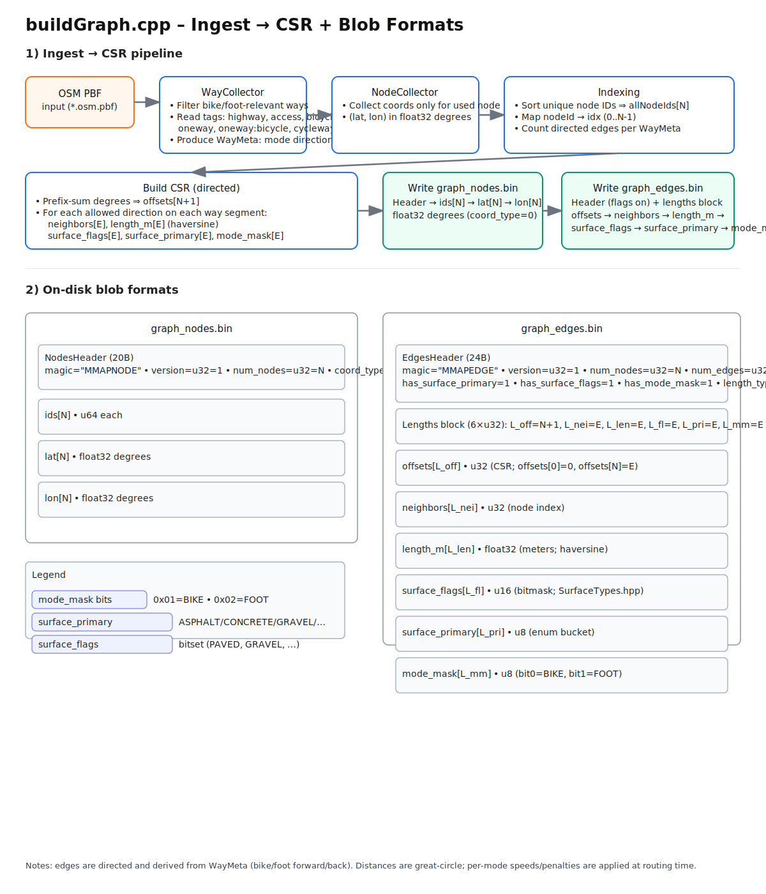

# Injest
flowchart TB
    A[OSM PBF] --> B[WayCollector • pick bike/foot-relevant ways • read tags: highway, access, bicycle, foot,   oneway, oneway:bicycle, cycleway, surface • compute WayMeta:   - bike_fwd/back, foot_fwd/back   - surface_primary, surface_flags]
    A --> C[NodeCollector • collect coords only for used node IDs]

    B --> D[Build ID mapping • allNodeIds (sorted) • nodeId → idx (0..N-1)]
    C --> D

    D --> E[Count directed edges • for each consecutive pair in way:   - if (bike_fwd || foot_fwd) ++deg[u]   - if (bike_back || foot_back) ++deg[v] • prefix-sum → offsets (CSR)]

    E --> F[Fill CSR arrays (size E) • neighbors, length_m (haversine) • surface_flags (u16), surface_primary (u8) • mode_mask (u8: bit0=BIKE, bit1=FOOT) • write both directions as permitted]

    F --> G[[graph_nodes.bin]]
    F --> H[[graph_edges.bin]]

flowchart TB
    subgraph N[graph_nodes.bin]
      nh[NodesHeader (20B) magic "MMAPNODE" version u32=1 num_nodes u32=N coord_type u8=0 (float32 deg) reserved[3]]
      nids[ids[N] • u64 each]
      nlat[lat[N] • float32 deg]
      nlon[lon[N] • float32 deg]
    end

    subgraph E[graph_edges.bin]
      eh[EdgesHeader (24B) magic "MMAPEDGE" version u32=1 num_nodes u32=N num_edges u32=E has_surface_primary=1 has_surface_flags=1 has_mode_mask=1 length_type=0 (float32 m)]
      elens[Lengths block (6×u32) L_off=N+1, L_nei=E, L_len=E, L_fl=E, L_pri=E, L_mm=E]
      off[offsets[L_off] • u32 CSR: offsets[0]=0, offsets[N]=E]
      nei[neighbors[L_nei] • u32 (node idx)]
      len[length_m[L_len] • float32 (meters)]
      sfl[surface_flags[L_fl] • u16 (bitmask)]
      spr[surface_primary[L_pri] • u8 (enum)]
      mm[mode_mask[L_mm] • u8 (bits)]
    end

    mm --> L1[mode_mask bits: bit0 (0x01): BIKE allowed bit1 (0x02): FOOT allowed]
    sfl --> L2[surface_flags: bitset from SurfaceTypes.hpp (e.g., PAVED/GRAVEL/etc.)]
    spr --> L3[surface_primary: compact enum bucket (ASPHALT/CONCRETE/GRAVEL/…)]

## data formats

# Backend
## route.cpp
1. Node loads addon → addon mmaps graph_nodes.bin + graph_edges.bin.

2. Client hits /route (your Express layer) → calls findPath({sourceIdx,targetIdx,…}, cb).

3. Async worker runs A* on the CSR with filters/speeds/penalties.

4. On success: returns { path, modes, distance_m, duration_s } to JS.

5. JS turns node indices into lat/lon (or uses a prebuilt coordinate array) and draws the polyline; color by modes or surface if desired.
## Routing model: two-layer A*
  - ### Modes & layers
    - Edge mode_mask bits: 0x01=BIKE, 0x02=FOOT.
    - Search state is (node, layer) ⇒ 2N states.
    - You can move along edges within a layer or switch layers at the same node with a time penalty.

  - ### Parameters (AStarParams)
    - bike_surface_mask, walk_surface_mask (u16 filters against surface_flags).
    - Speeds: bike_speed_mps, walk_speed_mps.
    - Switch penalties: ride_to_walk_penalty_s, walk_to_ride_penalty_s.
    - Optional per-surface primary time multipliers (arrays indexed by surface_primary u8).

  - ### Heuristic (admissible)
    - Straight-line haversine to target divided by max(bike_speed, walk_speed) so it’s optimistic across layers.

  - ### Relaxation
    - Edge relax (same layer): if edge allows the layer’s mode and passes surface filter, cost = length / speed * factor.
    - Switch relax (same node): add penalty to change layer.

  - ### Goal
    - First time the queue pops target in any layer, that’s optimal.

  - ### Reconstruction & metrics
    - Walk parent pointers to build a (node, layer) chain.
    - Convert to path_nodes (indices) and path_modes (per step: 1=BIKE, 2=FOOT), skipping duplicate nodes created by switches.
    - Compute distance_m (sum of edge lengths) and duration_s (movement + switch penalties).

  - ### Edge cases:
    - If no path is found, returns { success:false } internally; JS callback gets "no route" error string.

## N-API surface
  - ### Init
    - On module load (Init): maps both blobs (../data/graph_nodes.bin, ../data/graph_edges.bin), prints N and E, optionally madvi(MADV_RANDOM) for edge arrays.
    - Exports findPath.

  - ### findPath(options, callback)
    - Validates sourceIdx and targetIdx (u32).
    - Parses optional params: masks, speeds, penalties, bikeSurfaceFactor[], walkSurfaceFactor[].
    - Runs routing in a Napi::AsyncWorker (off the Node event loop).
    - *Callback signature: (err, result) where:*
      - err is null on success or a string (e.g., "no route").
      - result = { path: number[], modes: number[], distance_m: number, duration_s: number }.

### Concurrency/safety:

- The global G_nodes/G_edges are immutable; each request builds its own local vectors for A* state ⇒ thread-safe across concurrent calls.
- Throughput depends on libuv pool size (UV_THREADPOOL_SIZE).

# Frontend