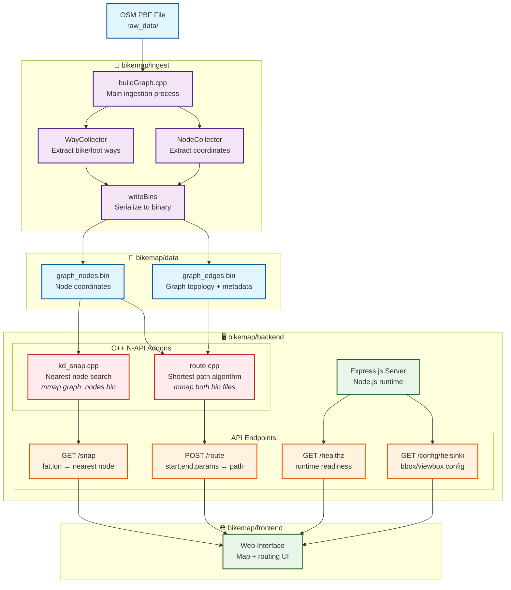

# Welcome to Bike-Helsinki Preview
## https://bikehelsinki.onrender.com/

Actively in development — a free tool to help you plan and follow routes that make the most of Helsinki's excellent bike infrastructure, beautiful and abundant trails, and nature. Bike-Helsinki uses OpenStreetMap data and custom A* routing to find bike-friendly paths across the city and beyond. Click the map to set start and end points, adjust surface preferences, then start a trip to follow your route with a live GPS follow-camera.

**Recent work:** navigation mode and follow-camera behavior.
**Coming soon:** a full rework of the OSM data pipeline for richer, more accurate routing going beyond surface type filtering to selecting routes by overall bike-friendliness and surface quality.

## Bike-Helsinki Application Architecture

### System Overview


```mermaid
flowchart TD
    %% Data Sources
    OSM[OSM PBF File<br/>raw_data/]

    %% Ingestion Process
    subgraph INGEST [" 🔄 bikemap/ingest "]
        BUILD[buildGraph.cpp<br/>Main ingestion process]
        WAY[WayCollector<br/>Extract bike/foot ways]
        NODE[NodeCollector<br/>Extract coordinates]
        WRITE[writeBins<br/>Serialize to binary]
    end

    %% Generated Data
    subgraph DATA [" 💾 bikemap/data "]
        NODES[graph_nodes.bin<br/>Node coordinates]
        EDGES[graph_edges.bin<br/>Graph topology + metadata]
    end

    %% Backend
    subgraph BACKEND [" 🖥️ bikemap/backend "]
        EXPRESS[Express.js Server<br/>Node.js runtime]

        subgraph ADDONS [" C++ N-API Addons "]
            KDSNAP[kd_snap.cpp<br/>Nearest node search<br/><em>mmap graph_nodes.bin</em>]
            ROUTE[route.cpp<br/>Shortest path algorithm<br/><em>mmap both bin files</em>]
        end

        subgraph ENDPOINTS [" API Endpoints "]
            HEALTH_EP[GET /healthz<br/>runtime readiness]
            SNAP_EP[GET /snap<br/>lat,lon → nearest node]
            ROUTE_EP[POST /route<br/>start,end,params → path]
            CONFIG_EP[GET /config/helsinki<br/>bbox/viewbox config]
        end
    end

    %% Frontend (placeholder)
    subgraph FRONTEND [" 🌐 bikemap/frontend "]
        UI[Web Interface<br/>Map + routing UI]
    end

    %% Flow connections - Ingestion
    OSM --> BUILD
    BUILD --> WAY
    BUILD --> NODE
    WAY --> WRITE
    NODE --> WRITE
    WRITE --> NODES
    WRITE --> EDGES

    %% Flow connections - Backend
    NODES --> KDSNAP
    NODES --> ROUTE
    EDGES --> ROUTE

    EXPRESS --> HEALTH_EP
    KDSNAP --> SNAP_EP
    ROUTE --> ROUTE_EP
    EXPRESS --> CONFIG_EP

    %% Flow connections - API
    HEALTH_EP --> UI
    SNAP_EP --> UI
    ROUTE_EP --> UI
    CONFIG_EP --> UI

    %% Styling
    classDef dataFile fill:#e1f5fe,stroke:#01579b,stroke-width:2px
    classDef process fill:#f3e5f5,stroke:#4a148c,stroke-width:2px
    classDef service fill:#e8f5e8,stroke:#1b5e20,stroke-width:2px
    classDef api fill:#fff3e0,stroke:#e65100,stroke-width:2px
    classDef cpp fill:#ffebee,stroke:#c62828,stroke-width:2px

    class OSM,NODES,EDGES dataFile
    class BUILD,WAY,NODE,WRITE process
    class EXPRESS,UI service
    class HEALTH_EP,SNAP_EP,ROUTE_EP,CONFIG_EP api
    class KDSNAP,ROUTE cpp
```

### Architecture Docs

Detailed architecture references:

- [`docs/frontend/frontend-architecture.md`](docs/frontend/frontend-architecture.md) — component hierarchy, state ownership, feature boundaries, data flow
- [`docs/frontend/camera-behavior.md`](docs/frontend/camera-behavior.md) — camera mode contract, planning/navigation transitions, acceptance criteria
- [`docs/backend/backend-architecture.md`](docs/backend/backend-architecture.md) — backend layering, native addon boundary, request flow

### Binary file formats
```
graph_nodes.bin

┌─────────────────┬──────┬─────────────────────────────────┐
│ NodesHeader     │ 16B  │ File metadata                   │
├─────────────────┼──────┼─────────────────────────────────┤
│   magic[8]      │  8B  │ "MMAPNODE" identifier           │
│   numNodes      │  4B  │ Count of nodes (N)              │
│   reserved      │  4B  │ Padding                         │
├─────────────────┼──────┼─────────────────────────────────┤
│ NodeIDs         │ N*8B │ OSM node identifiers            │
│   id[0]         │  8B  │ uint64_t                        │
│   id[1]         │  8B  │ uint64_t                        │
│   ...           │ ...  │ ...                             │
│   id[N-1]       │  8B  │ uint64_t                        │
├─────────────────┼──────┼─────────────────────────────────┤
│ Latitudes       │ N*4B │ Coordinates (degrees)           │
│   lat[0]        │  4B  │ float32 (WGS84)                 │
│   lat[1]        │  4B  │ float32                         │
│   ...           │ ...  │ ...                             │
│   lat[N-1]      │  4B  │ float32                         │
├─────────────────┼──────┼─────────────────────────────────┤
│ Longitudes      │ N*4B │ Coordinates (degrees)           │
│   lon[0]        │  4B  │ float32 (WGS84)                 │
│   lon[1]        │  4B  │ float32                         │
│   ...           │ ...  │ ...                             │
│   lon[N-1]      │  4B  │ float32                         │
└─────────────────┴──────┴─────────────────────────────────┘
```
```
graph_edges.bin

Format: Compressed Sparse Row (CSR) adjacency list
Edge lookup: for node i, edges are neighbors[offset[i]:offset[i+1]]

┌─────────────────────┬────────┬─────────────────────────────────────────┐
│ EdgesHeader         │  20B   │ File metadata                           │
├─────────────────────┼────────┼─────────────────────────────────────────┤
│   magic[8]          │   8B   │ "MMAPEDGE" identifier                   │
│   numNodes          │   4B   │ Count of nodes                          │
│   numEdges          │   4B   │ Count of directed edges                 │
│   hasSurfacePrimary │   1B   │ Surface data present (1)                │
│   hasModeMask       │   1B   │ Mode data present (1)                   │
│   lengthType        │   1B   │ Length format (0=float32)               │
│   reserved          │   1B   │ Padding                                 │
├─────────────────────┼────────┼─────────────────────────────────────────┤
│ Array Sizes         │  20B   │ Defensive parsing metadata              │
│   offsetsSize       │   4B   │ uint32_t: offsets array length          │
│   neighborsSize     │   4B   │ uint32_t: neighbors array length        │
│   lengthsSize       │   4B   │ uint32_t: lengths array length          │
│   surfacePrimSize   │   4B   │ uint32_t: surface array length          │
│   modeMasksSize     │   4B   │ uint32_t: mode masks array length       │
├─────────────────────┼────────┼─────────────────────────────────────────┤
│ Offsets             │(N+1)*4B│ CSR adjacency list pointers             │
│   offset[0]         │   4B   │ uint32_t: start of node 0 edges         │
│   offset[1]         │   4B   │ uint32_t: start of node 1 edges         │
│   ...               │  ...   │ ...                                     │
│   offset[N]         │   4B   │ uint32_t: end marker                    │
├─────────────────────┼────────┼─────────────────────────────────────────┤
│ Neighbors           │ E*4B   │ Target node indices                     │
│   neighbor[0]       │   4B   │ uint32_t: target node index             │
│   neighbor[1]       │   4B   │ uint32_t: target node index             │
│   ...               │  ...   │ ...                                     │
│   neighbor[E-1]     │   4B   │ uint32_t: target node index             │
├─────────────────────┼────────┼─────────────────────────────────────────┤
│ Lengths             │ E*4B   │ Edge lengths in meters                  │
│   length[0]         │   4B   │ float32: distance in meters             │
│   length[1]         │   4B   │ float32: distance in meters             │
│   ...               │  ...   │ ...                                     │
│   length[E-1]       │   4B   │ float32: distance in meters             │
├─────────────────────┼────────┼─────────────────────────────────────────┤
│ Surface Primary     │ E*1B   │ Primary surface type                    │
│   surface[0]        │   1B   │ uint8_t: SurfacePrimary enum            │
│   surface[1]        │   1B   │ uint8_t: SurfacePrimary enum            │
│   ...               │  ...   │ ...                                     │
│   surface[E-1]      │   1B   │ uint8_t: SurfacePrimary enum            │
├─────────────────────┼────────┼─────────────────────────────────────────┤
│ Mode Masks          │ E*1B   │ Allowed transport modes                 │
│   mode[0]           │   1B   │ uint8_t: bike(1)|foot(2) flags          │
│   mode[1]           │   1B   │ uint8_t: bike(1)|foot(2) flags          │
│   ...               │  ...   │ ...                                     │
│   mode[E-1]         │   1B   │ uint8_t: bike(1)|foot(2) flags          │
└─────────────────────┴────────┴─────────────────────────────────────────┘
```

## Developer Tools

### Preview Trip (dev only)

Preview Trip is a development-only feature, active only when `NODE_ENV=development` (tree-shaken out of production builds). It lets you simulate a trip along a planned route without a real GPS signal, which is useful for testing navigation mode and camera behavior on desktop.

To use it:
1. Plan a route use current location (GPS on) for S and select a T.
2. Click **Preview Trip** in the route planner panel. This starts a trip and injects a simulated GPS position that auto-advances along the route.
3. A scrub slider appears at the bottom of the screen. Drag it to jump to any point along the route; releasing resumes auto-advance.
4. The map enters navigation mode: the camera follows the preview position and rotates to the route bearing, identical to a real trip.
5. Opening the panel during preview suspends follow-camera and shows planning-style route framing, exactly as it would on a real trip.
6. Select 'Stop Trip' to end the preview

# BikeMap Local Setup Guide

## Prerequisites

- **C++ compiler** (with C++17 support)
- **CMake** (version 3.16+)
- **Node.js** (version 20.x recommended)
- **npm**

## 1. Data Ingestion

### Fetch OSM data and build graph

```bash
# From project root

cd ingest
./all.sh
```

This script will:
- Download latest Finland OSM data
- Extract Helsinki region
- Build and run the ingestion code
- Generate `graph_nodes.bin` and `graph_edges.bin` in `../data/`

## 2. Backend Setup

### Install dependencies

```bash
# From project root

cd backend
```

```bash
npm install
```

Core dependencies include:
- `node-addon-api` - N-API bindings
- `node-gyp` - Native addon build tool
- `express`

### Build C++ addons

```bash
npm run build:native

or

cd bindings
npx node-gyp configure && npx node-gyp build
or
npx node-gyp rebuild --release
```

This compiles `kd_snap.cpp` and `route.cpp` with optimizations enabled.

### Start server

```bash
npm run dev
```

Server will start on `http://localhost:3000` with endpoints:
- `GET /healthz` - Runtime readiness and graph metadata
- `GET /snap` - Find nearest graph node
- `POST /route` - Calculate optimal route
- `GET /config/helsinki` - Return bbox/viewbox config for the frontend

## 3. Frontend Setup

### Install dependencies

```bash
# From project root

cd frontend
```

```bash
npm install
```

Key dependencies include:
- `react-map-gl` & `maplibre-gl` - Interactive maps
- `axios` - API communication

### Start development server

```bash
npm run dev
```

Frontend will be available at `http://localhost:5173` (or similar).

## Contributing

Follow the branch naming and commit message conventions before starting work:

- **Branch naming:** `type/name` — e.g. `feat/add-route-export`, `fix/snap-off-by-one`
  Valid types: `feat`, `fix`, `refactor`, `tests`, `chore`, `docs`, `style`
- **Commit messages:** `[branch-name] type(scope): summary` — see `docs/commitMessageStyle.md`
- **Git workflow:** branching, rebasing, squashing WIP commits — see `docs/gitWorkFlow.md`

Install the git hooks once per clone to enforce these automatically:
```bash
sh scripts/install-hooks.sh
```
