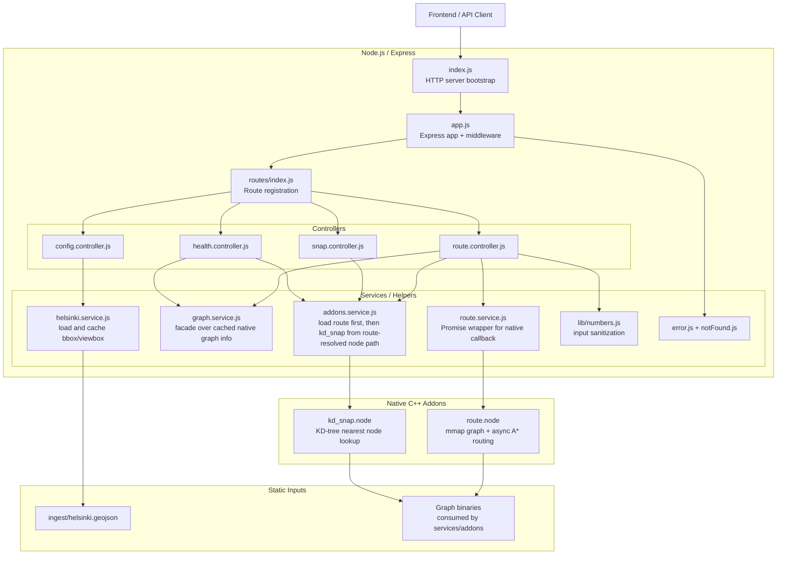

# Backend Architecture Notes

This document describes the current backend architecture of this project. It intentionally ignores `backend/data/` contents and focuses on code structure, runtime flow, and service boundaries.

## Overview

The backend is a small Node/Express API that acts primarily as an orchestration layer in front of two native C++ addons.

- The Node side handles HTTP, validation, defaults, error handling, and JSON shaping.
- The C++ side performs nearest-node lookup and route finding.
- There is no database or ORM layer.
- Most runtime state is loaded eagerly at startup and then treated as read-only.

At a high level, the backend is a layered monolith:

`routes -> controllers -> services/native addons`

## Diagram

## Runtime Entry Points

[`backend/index.js`](/Users/willdonnelly/Documents/code/bikeMap/backend/index.js) is the process entrypoint.

- Creates an HTTP server around the Express app.
- Listens on `env.PORT`.
- Handles `SIGTERM`.
- Closes the server on unhandled promise rejections.

[`backend/app.js`](/Users/willdonnelly/Documents/code/bikeMap/backend/app.js) builds the Express application.

- Disables `x-powered-by`.
- Enables JSON parsing and CORS.
- Optionally serves the frontend bundle when `SERVE_STATIC=1`.
- Mounts the API router at `/`.
- Ends with `notFound` and `errorHandler` middleware.

This means the HTTP shell is intentionally thin. There is no elaborate application container, dependency injection system, or plugin architecture.

## Route Layer

[`backend/routes/index.js`](/Users/willdonnelly/Documents/code/bikeMap/backend/routes/index.js) centralizes route registration:

- `GET /healthz`
- `GET /snap`
- `POST /route`
- `GET /config/helsinki`

Each feature has its own small route file, but those files only bind an HTTP verb and path to a controller. They do not contain business logic.

## Controller Layer

The controllers are where request parsing meets service calls.

### Health

[`backend/controllers/health.controller.js`](/Users/willdonnelly/Documents/code/bikeMap/backend/controllers/health.controller.js)

- Checks whether both native addons loaded.
- Reads cached native graph metadata from `graph.service.js`.
- Returns `200` only if both addons are available and the native router reports a loaded graph.

This endpoint acts as a runtime readiness check more than a generic liveness probe.

### Snap

[`backend/controllers/snap.controller.js`](/Users/willdonnelly/Documents/code/bikeMap/backend/controllers/snap.controller.js)

- Parses `lat` and `lon` from query params.
- Validates they are finite numbers.
- Calls the native KD-tree addon.
- Returns the nearest graph node as `{ idx, lat, lon }`.

This controller is almost entirely a validation wrapper around the native nearest-neighbor lookup.

### Route

[`backend/controllers/route.controller.js`](/Users/willdonnelly/Documents/code/bikeMap/backend/controllers/route.controller.js)

This is the main orchestration endpoint.

It performs the following sequence:

1. Verifies the native router addon is loaded.
2. Verifies the graph metadata reports a positive node count.
3. Reads `startIdx`, `endIdx`, and optional routing parameters from the request body.
4. Validates node indices against `TOTAL_NODES`.
5. Applies defaults for surface mask, speeds, penalties, and surface penalties.
6. Sanitizes optional factor arrays via `lib/numbers.js`.
7. Calls the native route addon asynchronously through `route.service.js`.
8. Converts the returned path indices into coordinates.
9. Returns a JSON payload with path, coordinates, modes, and distance/duration metrics.

The controller does not implement the routing algorithm itself. Its job is to normalize inputs, invoke the native worker, and shape the response for the frontend.

### Config

[`backend/controllers/config.controller.js`](/Users/willdonnelly/Documents/code/bikeMap/backend/controllers/config.controller.js)

- Loads Helsinki-specific map config from `helsinki.service.js`.
- Returns bbox/viewbox information for client-side geocoding or map constraints.
- Delegates errors to Express error middleware.

This is operationally separate from routing. It is configuration delivery, not graph processing.

## Service Layer

### Native Addon Loader

[`backend/services/addons.service.js`](/Users/willdonnelly/Documents/code/bikeMap/backend/services/addons.service.js)

This is the most important backend service on the Node side.

Responsibilities:

- Eagerly loads `route.node`.
- Reads `route.node` graph metadata immediately after load.
- Injects the resolved route-owned nodes path before loading `kd_snap.node`.
- Eagerly loads `kd_snap.node` second so it follows the route-owned node path.
- Exposes booleans for addon availability.
- Exposes addon handles for controller use.
- Pulls `LAT` and `LON` typed arrays from `kd_snap.node` when available.

Those `LAT` and `LON` typed arrays are a key part of the architecture. They let the route controller map node indices back to coordinates in JavaScript without making repeated per-node addon calls. That keeps the JS response-building step cheap even when a route contains many nodes.

### Graph Metadata Service

[`backend/services/graph.service.js`](/Users/willdonnelly/Documents/code/bikeMap/backend/services/graph.service.js)

This service no longer reads graph files directly. It is a small facade over the graph metadata exported by the native router addon and cached in `addons.service.js`.

Responsibilities:

- Exposes `getGraphInfo()`.
- Exposes `getTotalNodes()` as a convenience wrapper.
- Exposes `getNodesPath()` and `getEdgesPath()` from cached native metadata.

Architecturally, this service is used for validation and health reporting, but it does so by reflecting native runtime state rather than deriving a separate view from disk.

### Route Wrapper Service

[`backend/services/route.service.js`](/Users/willdonnelly/Documents/code/bikeMap/backend/services/route.service.js)

This service is intentionally tiny. It wraps the callback-style native `findPath` interface in a Promise so the controller can use `await`.

### Helsinki Config Service

[`backend/services/helsinki.service.js`](/Users/willdonnelly/Documents/code/bikeMap/backend/services/helsinki.service.js)

Responsibilities:

- Reads `ingest/helsinki.geojson`.
- Computes a bbox using `lib/computeBBox.js`.
- Builds a Nominatim-compatible `viewbox`.
- Caches the parsed result in memory.

This service is read-mostly and independent from the routing engine.

### Shared Helpers

[`backend/lib/numbers.js`](/Users/willdonnelly/Documents/code/bikeMap/backend/lib/numbers.js)

- Parses integer-like indices.
- Clamps masks to `uint16`.
- Applies fallback defaults for finite numeric values.
- Sanitizes factor arrays.

[`backend/lib/computeBBox.js`](/Users/willdonnelly/Documents/code/bikeMap/backend/lib/computeBBox.js)

- Walks GeoJSON recursively.
- Computes `[minLon, minLat, maxLon, maxLat]`.

These helpers keep controllers small and keep validation logic out of the route declarations.

## Native Addon Boundary

The most important architectural seam in this backend is the boundary between JavaScript and the native addons.

### KD Snap Addon

[`backend/bindings/kd_snap.cpp`](/Users/willdonnelly/Documents/code/bikeMap/backend/bindings/kd_snap.cpp)

This addon:

- Loads node coordinate data from the graph nodes binary.
- Builds an in-memory packed 2D KD-tree.
- Exports:
  - `findNearest(lat, lon) -> idx`
  - `getNode(idx) -> { idx, lat, lon }`
  - `getLatArray()`
  - `getLonArray()`

This addon is the spatial lookup engine used by `GET /snap` and also supplies the shared coordinate arrays used by `POST /route`.

### Route Addon

[`backend/bindings/route.cpp`](/Users/willdonnelly/Documents/code/bikeMap/backend/bindings/route.cpp)

This addon:

- Memory-maps the graph node and edge binaries.
- Parses the graph as a CSR adjacency structure.
- Accepts route options from JS.
- Runs a two-layer A* search in a `Napi::AsyncWorker`.
- Returns:
  - path node indices
  - path modes
  - distance and duration metrics
  - distance broken down by ride/walk categories

This is the real compute engine of the backend. The JS layer never performs graph traversal itself.

## End-to-End Request Paths

### `GET /snap`

Request flow:

1. Express route matches `/snap`.
2. `snap.controller.js` validates `lat/lon`.
3. `addons.service.js` provides the `kdSnap` addon handle.
4. `kd_snap.node` finds the nearest graph node.
5. Controller returns JSON.

### `POST /route`

Request flow:

1. Express route matches `/route`.
2. `route.controller.js` validates indices and route options.
3. `graph.service.js` provides cached native graph metadata for node-count validation.
4. `addons.service.js` provides the router addon and typed arrays.
5. `route.service.js` wraps native `findPath`.
6. `route.node` runs async A* over the mapped graph.
7. JS rebuilds route coordinates from `LAT/LON`.
8. Controller returns the final JSON payload.

### `GET /config/helsinki`

Request flow:

1. Express route matches `/config/helsinki`.
2. `config.controller.js` calls `helsinki.service.js`.
3. The GeoJSON boundary is read and cached.
4. The computed bbox/viewbox is returned.

## State and Lifecycle

This backend is mostly read-only after startup.

The main in-process state is:

- loaded addon handles
- `LAT` and `LON` typed arrays
- cached native graph metadata
- cached Helsinki bbox/viewbox config

There is no request-scoped persistence and no mutable business state shared across requests. That makes the request handlers effectively stateless after boot, aside from in-memory caches and loaded native resources.

## Error Handling

The middleware layer is simple:

- [`backend/middleware/notFound.js`](/Users/willdonnelly/Documents/code/bikeMap/backend/middleware/notFound.js) returns JSON 404s.
- [`backend/middleware/error.js`](/Users/willdonnelly/Documents/code/bikeMap/backend/middleware/error.js) logs errors and returns a JSON error payload.

Controllers also handle some errors locally where behavior matters:

- missing addons return `503`
- bad input returns `400`
- missing route results return an empty successful route payload
- unexpected native failures return `500`

That is pragmatic for this codebase, although error behavior is not fully centralized.

## Deployment Shape

[`backend/package.json`](/Users/willdonnelly/Documents/code/bikeMap/backend/package.json) shows the backend as a Node 20 CommonJS app with a native build step:

- `npm run dev` runs `node --watch index.js`
- `npm run build:native` rebuilds the C++ addons with `node-gyp`

[`render.yaml`](/Users/willdonnelly/Documents/code/bikeMap/render.yaml) deploys the backend as its own Render web service:

- root directory: `backend`
- build command: `npm ci && npm run build:native`
- start command: `node index.js`
- health check path: `/healthz`

So operationally, the backend is a standalone API service, not a serverless function or a combined frontend/backend deployment in production.

## Architectural Strengths

- Clear layering between HTTP shell and compute engine.
- Very small controller and route surface area.
- Good separation between request validation and native graph computation.
- Efficient coordinate reconstruction through shared typed arrays.
- Mostly stateless request handling after initialization.
- Native routing work is offloaded from the Node event loop via `AsyncWorker`.

## Architectural Risk: Split Graph Configuration

The refactor to `router.getGraphInfo()` removed the JavaScript metadata drift, and the backend now treats `route.node` as the primary graph owner.

Today the loading order is:

1. `route.node` initializes first and resolves the effective graph paths.
2. `addons.service.js` caches `router.getGraphInfo()`.
3. The resolved `nodesPath` is injected into `kd_snap.node`.
4. `kd_snap.node` initializes second using the route-owned node path.

That means `kd_snap` is now operationally secondary to `route`, which is closer to the intended architecture.

The remaining coupling risk is narrower than before:

- `route.node` still resolves its own graph paths internally from hardcoded defaults
- `kd_snap.node` still contains a fallback hardcoded path if no route-owned path is injected

So there is still not one explicit shared graph configuration object passed into both native modules from outside the addons themselves.

In practice, the important behavioral divergence has been removed because:

- JS no longer derives a separate graph view from disk
- `kd_snap` follows the resolved `nodesPath` chosen by `route`
- health/debug output can now expose both router and kd-snap graph metadata

The cleanest future direction, if this needs to go further, is:

- move graph path resolution into one explicit startup configuration step
- pass both `nodesPath` and `edgesPath` into the native addons as initialization inputs
- remove fallback hardcoded paths from `kd_snap.cpp` and `route.cpp`

At this point, though, the architecture already reflects the intended ownership model: `route` is primary, `kd_snap` follows it, and JS only caches native-reported metadata.

## Summary

This backend is best understood as a thin Express control plane wrapped around a native routing engine.

- Express handles transport, validation, and response shaping.
- Native addons handle spatial indexing and shortest-path computation.
- Startup eagerly loads read-only graph-backed resources.
- Requests are mostly stateless after boot.
- The main architectural weakness is that graph path resolution still originates inside the native layer rather than from one explicit shared startup configuration object.
