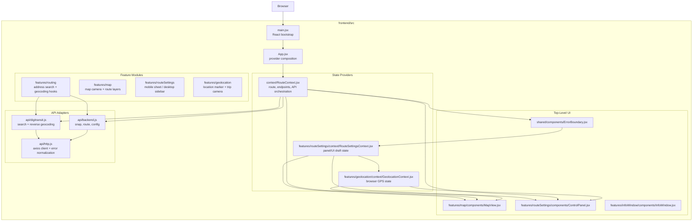

# Frontend Architecture Notes

This document describes the current frontend architecture under `frontend/`. It intentionally ignores `node_modules/` and build output and focuses on source structure, runtime flow, state ownership, and feature boundaries.

## Overview

The frontend is a Vite + React single-page application centered around an interactive map and a route-planning control surface.

- `main.jsx` bootstraps React and global CSS.
- `App.jsx` is intentionally thin and mainly composes providers plus the three top-level UI surfaces: the map, the route settings panel, and the onboarding/info dialog.
- Most application behavior is driven through React context providers rather than a dedicated state library.
- The codebase is organized mostly by feature, with `shared/` and `api/` acting as cross-cutting layers.

At a high level, the frontend behaves like this:

`providers/state -> user interaction -> API/geolocation -> derived route/map rendering`

## Diagram

## Runtime Entry Points

[`frontend/src/main.jsx`](/Users/willdonnelly/Documents/code/bikeMap/frontend/src/main.jsx) is the browser entrypoint.

- Loads MapLibre CSS and global app CSS.
- Creates the React root and renders `App`.

[`frontend/src/App.jsx`](/Users/willdonnelly/Documents/code/bikeMap/frontend/src/App.jsx) defines the top-level composition:

1. `RouteProvider`
2. `ErrorBoundary`
3. `RouteSettingsProvider`
4. `GeolocationProvider`
5. `AppContent`

`AppContent` then renders:

- [`MapView`](/Users/willdonnelly/Documents/code/bikeMap/frontend/src/features/map/components/MapView.jsx)
- [`ControlPanel`](/Users/willdonnelly/Documents/code/bikeMap/frontend/src/features/routeSettings/components/ControlPanel.jsx)
- [`InfoWindow`](/Users/willdonnelly/Documents/code/bikeMap/frontend/src/features/infoWindow/components/InfoWindow.jsx)

This means the root is mostly composition, while feature behavior lives in contexts and feature hooks.

## Source Layout

The source tree is mostly feature-oriented.

### `api/`

[`frontend/src/api/http.js`](/Users/willdonnelly/Documents/code/bikeMap/frontend/src/api/http.js) creates the shared Axios client, resolves the backend base URL from `VITE_API_URL`, and normalizes common HTTP errors into `err.userMessage`.

[`frontend/src/api/backend.js`](/Users/willdonnelly/Documents/code/bikeMap/frontend/src/api/backend.js) wraps the project backend endpoints:

- `GET /snap`
- `POST /route`
- `GET /config/helsinki`
- `GET /healthz` with a `GET /meta` fallback path in `getMeta()`

[`frontend/src/api/digitransit.js`](/Users/willdonnelly/Documents/code/bikeMap/frontend/src/api/digitransit.js) is a second HTTP adapter for Digitransit search and reverse geocoding.

Architecturally, this layer is thin. It does transport and payload normalization, but not application state.

### `context/`

This folder contains the actual route state container, even though routing is also re-exported from `features/routing/`.

[`frontend/src/context/RouteContext.jsx`](/Users/willdonnelly/Documents/code/bikeMap/frontend/src/context/RouteContext.jsx) is the main application state hub.

It owns:

- Helsinki config fetched from the backend
- snapped start/end endpoints
- route coordinates and per-segment route modes
- applied route preferences
- route totals and loading state
- actions for snapping, geocoding, dragging, and route fetching

This is the most important frontend module. It is effectively the orchestration layer for the whole app.

### `features/`

Feature packages contain most UI and lifecycle logic.

- `features/map/`: MapLibre rendering, route polylines, camera fit behavior.
- `features/routing/`: address search inputs and search debounce hooks.
- `features/routeSettings/`: desktop sidebar, mobile sheet, route preference controls, and view-only draft state.
- `features/geolocation/`: browser geolocation state, live location rendering, and trip-follow camera logic.
- `features/infoWindow/`: onboarding modal and its local visibility hook.

### `shared/`

Shared holds low-level utilities and constants:

- `useIsMobile`
- formatting/math helpers
- app-wide constants for debounce, breakpoints, zoom levels, and API timeout
- a reusable `ErrorBoundary`

This is a utility layer rather than a feature layer.

## State Ownership And Data Flow

### Route State

[`frontend/src/context/RouteContext.jsx`](/Users/willdonnelly/Documents/code/bikeMap/frontend/src/context/RouteContext.jsx) coordinates the core route-planning flow:

1. Fetch Helsinki bbox/viewbox config on mount.
2. Accept endpoint changes from map clicks, marker drags, address search, or GPS.
3. Snap user coordinates to backend graph nodes via `/snap`.
4. Reverse geocode snapped endpoints for display labels when needed.
5. When both endpoints exist, request `/route`.
6. Store returned coordinates, per-segment modes, totals, and loading state.

This context mixes remote data fetching, mutation logic, and derived UI state in one place. That makes the app simple to follow, but it also makes `RouteContext` a large central dependency.

### Route Settings State

[`frontend/src/features/routeSettings/context/RouteSettingsContext.jsx`](/Users/willdonnelly/Documents/code/bikeMap/frontend/src/features/routeSettings/context/RouteSettingsContext.jsx) is a UI-state layer that sits on top of route state.

It owns:

- whether the planner panel is open
- mobile sheet sizing/offset bookkeeping
- draft surface mask and draft penalty values
- satellite view preference persisted to `localStorage`
- explicit route-refit triggers for mobile flows

This provider does not fetch routes directly. It stages UI edits and then delegates final application back into `RouteContext.settings.applySettings`.

### Geolocation State

[`frontend/src/features/geolocation/context/GeolocationContext.jsx`](/Users/willdonnelly/Documents/code/bikeMap/frontend/src/features/geolocation/context/GeolocationContext.jsx) owns browser geolocation lifecycle:

- current GPS position
- locate mode on/off
- trip mode on/off
- permission or acquisition errors
- `watchPosition` registration and cleanup

Map rendering and control panel actions both consume this context, but the context itself is independent from backend routing.

## Feature Boundaries

### Map

[`frontend/src/features/map/components/MapView.jsx`](/Users/willdonnelly/Documents/code/bikeMap/frontend/src/features/map/components/MapView.jsx) is the main visual canvas.

Responsibilities:

- create the `react-map-gl` / MapLibre map
- switch between street and satellite styles
- render draggable start/end markers
- forward map clicks into route actions
- render route polylines
- mount geolocation overlays and trip-follow controller

[`frontend/src/features/map/components/RoutePolylines.jsx`](/Users/willdonnelly/Documents/code/bikeMap/frontend/src/features/map/components/RoutePolylines.jsx) converts route coordinates plus backend-provided segment mode bits into colored GeoJSON layers.

[`frontend/src/features/map/hooks/useFitBounds.js`](/Users/willdonnelly/Documents/code/bikeMap/frontend/src/features/map/hooks/useFitBounds.js) owns camera fitting rules and contains special cases for:

- mobile vs desktop
- sheet/sidebar visibility
- trip mode
- explicit refit triggers
- marker drag refits

This feature is presentation-heavy, but it still contains meaningful UI orchestration in camera management.

### Routing / Search

[`frontend/src/features/routing/components/AddressSearch.jsx`](/Users/willdonnelly/Documents/code/bikeMap/frontend/src/features/routing/components/AddressSearch.jsx) is the user-facing entry point for text search and GPS-origin selection.

It bridges:

- `RouteContext` actions
- `GeolocationContext`
- debounced search state from [`useGeocoding`](/Users/willdonnelly/Documents/code/bikeMap/frontend/src/features/routing/hooks/useGeocoding.js)

The routing feature itself is fairly thin because most real routing orchestration still lives in `context/RouteContext.jsx`.

### Route Settings

The route settings feature has a clear split between shared state and two shells:

- [`DesktopSidebar`](/Users/willdonnelly/Documents/code/bikeMap/frontend/src/features/routeSettings/components/DesktopSidebar.jsx)
- [`MobileSheet`](/Users/willdonnelly/Documents/code/bikeMap/frontend/src/features/routeSettings/components/MobileSheet.jsx)

Both shells use the same route and geolocation contexts, but diverge in layout and interaction model.

Common responsibilities:

- open/close planner UI
- edit address inputs
- manage bulk surface-selection actions
- apply surface penalty changes
- show ride stats
- control geolocation/trip actions

Mobile adds extra complexity through a draggable bottom sheet and explicit route refit triggers to keep the map framed correctly around the sheet.

### Geolocation

The geolocation feature is split cleanly:

- [`GeolocationContext`](/Users/willdonnelly/Documents/code/bikeMap/frontend/src/features/geolocation/context/GeolocationContext.jsx) owns browser state
- [`LocationMarker`](/Users/willdonnelly/Documents/code/bikeMap/frontend/src/features/geolocation/components/LocationMarker.jsx) renders the live position and accuracy polygon
- [`TripController`](/Users/willdonnelly/Documents/code/bikeMap/frontend/src/features/geolocation/components/TripController.jsx) owns camera-follow behavior during locate/trip modes

This is one of the clearer feature boundaries in the app.

### Info Window

[`frontend/src/features/infoWindow/components/InfoWindow.jsx`](/Users/willdonnelly/Documents/code/bikeMap/frontend/src/features/infoWindow/components/InfoWindow.jsx) is a largely self-contained onboarding dialog.

Its visibility is controlled by [`useInfoWindow`](/Users/willdonnelly/Documents/code/bikeMap/frontend/src/features/infoWindow/hooks/useInfoWindow.js), which currently lives as component-local state in `AppContent` rather than in shared app state. It is rendered alongside the route-driven UI, but it does not currently consume `RouteContext` directly.

## Integration Boundaries

### Backend API

The frontend depends on the backend for three core behaviors:

- snapping arbitrary coordinates to graph nodes
- computing routes between node indices
- returning Helsinki bbox/viewbox config for bounded geocoding

That means the frontend does not compute graph routes itself. It is a client-side orchestrator around backend routing.

### Digitransit Geocoding

Text search and reverse geocoding do not go through the project backend. They call Digitransit directly from the browser using `VITE_DIGITRANSIT_KEY`.

Architecturally this creates a split integration model:

- project backend for graph-aware operations
- third-party geocoding API for address operations

## Architectural Characteristics

The current frontend has a few clear traits:

- It is a client-heavy SPA with no server-rendering layer.
- It favors React context over Redux, Zustand, or query libraries.
- It is mostly feature-organized, but the main route state container still lives in a generic `context/` folder.
- It uses hooks and contexts as the primary unit of orchestration.
- It uses inline styles and style objects in several features instead of a single styling system.

## Notable Risks And Weak Seams

### `RouteContext` Is A Large God Object

[`frontend/src/context/RouteContext.jsx`](/Users/willdonnelly/Documents/code/bikeMap/frontend/src/context/RouteContext.jsx) owns config loading, endpoint mutation, route fetching, reverse geocoding, search helpers, route preference application, and totals.

That keeps wiring simple, but it also means many unrelated UI features depend on one large provider. Future growth will likely make this the main frontend bottleneck.

### Feature Boundaries Are Slightly Blurred

`features/routing/RouteProvider.jsx` is only a re-export over [`context/RouteContext.jsx`](/Users/willdonnelly/Documents/code/bikeMap/frontend/src/context/RouteContext.jsx). So the public feature boundary says "routing", but the implementation lives outside the feature package.

This is workable, but it makes the folder structure less truthful than the runtime architecture.

### Camera Logic Is Distributed Across Multiple Places

Map camera behavior is split between:

- [`useFitBounds`](/Users/willdonnelly/Documents/code/bikeMap/frontend/src/features/map/hooks/useFitBounds.js)
- [`TripController`](/Users/willdonnelly/Documents/code/bikeMap/frontend/src/features/geolocation/components/TripController.jsx)
- route-settings-triggered refit ticks

The result is functional, but camera ownership is implicit rather than centralized.

### Some Effects Depend On Lint Suppressions And Closure Assumptions

Several hooks intentionally suppress exhaustive-deps warnings, especially in route fetching and camera fitting.

That is not automatically wrong, but it does mean correctness depends on informal closure assumptions rather than explicit dependency modeling.

### API Surface Still Contains Legacy/Fallback Behavior

[`frontend/src/api/backend.js`](/Users/willdonnelly/Documents/code/bikeMap/frontend/src/api/backend.js) still contains `getMeta()` with `/meta` fallback behavior even though the documented backend routes focus on `/healthz`, `/snap`, `/route`, and `/config/helsinki`.

That suggests some API compatibility logic remains in the client and may no longer be necessary.

## Summary

The frontend is a compact React SPA with a sensible feature-based layout, but the real architectural center is the route context. The app works as a thin orchestration layer over backend routing, direct geocoding APIs, and browser geolocation, while MapLibre acts as the primary rendering surface.

The strongest structural patterns are:

- provider-driven state composition
- feature packages for UI concerns
- thin transport adapters in `api/`

The main areas to watch as the app grows are:

- continued expansion of `RouteContext`
- fragmented camera ownership
- slight mismatch between folder boundaries and runtime ownership
